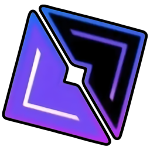

<h1 align="center"><b>Fedestrap</b></h1>

  <a href="https://github.com/fxderico/fedestrap/releases/latest">Latest release</a> |
  <a href="https://github.com/fxderico/fedestrap/wiki">Documentation</a> |
  <a href="https://discord.gg/SRs5zb9BJd">Discord</a>

[![Total Downloads][shield-repo-total]][repo-releases]
[![Latest Downloads][shield-repo-downloads]][repo-latest]
[![Latest Release][shield-repo-latest]][repo-latest]
[![Stars][shield-repo-stars]][repo-stargazers]

> [!NOTE]
> Fedestrap is a custom bootstrapper for Roblox, personally maintained for
> Fede, built on the [Bloxstrap][bloxstrap] → [Fishstrap][fishstrap] →
> [Voidstrap][voidstrap] lineage. It currently targets **Windows 10 and
> above**; the codebase carries cross-platform scaffolding for macOS and
> Linux inherited from Voidstrap, but those targets aren't actively
> maintained here. For Mac/Linux, try [AppleBlox][appleblox] or
> [Sober][sober].

If you found a bug, [open an issue][repo-new-issue].

## Installation

1. Download the latest release: https://github.com/fxderico/fedestrap/releases/latest
2. Run the installer and finish setup
3. Launch Fedestrap

## Features

Fedestrap inherits Voidstrap's much larger feature set on top of the usual
Bloxstrap-family basics (FastFlags editor with an allowlist warning, mod
manager, channel switching, cache cleaner, custom emoji fonts converted to
the COLR v0 format Roblox actually renders):

- Discord Rich Presence, RGB/theme customization, custom cursors and fonts
- Window manipulation, frame generation and render tuning options
- Google Fonts integration, translation service, gradient backgrounds
- Controller support (ViGEm), audio ducking, headset audio routing
- Game chat overlay, quest tracking, server matchmaking helpers
- An account system (sign in, friends, notifications, etc.) backed by a
  small self-hosted API — see [Accounts](#accounts) below for what that
  actually covers

Not every corner of the original Voidstrap platform is running here — see
[Accounts](#accounts).

## Accounts

Voidstrap's sign-in, friends, quests, marketplace, forums, notifications,
chat overlay, and theme-sharing features all depend on a live companion
backend that the original author runs. That's a full platform in its own
right (Roblox OAuth, real-time notifications, a database-backed social
graph, a marketplace, forums), not something reasonable to fork alongside
the desktop app.

Fedestrap ships with its own from-scratch, self-hosted **accounts API**
instead: simple username/password sign-in, capped at 2 accounts per IP.
Roblox OAuth sign-in specifically is not implemented. Features that depend
on the rest of the original platform (forums, marketplace, quests, chat,
theme sharing) aren't backed by anything — the app already degrades
gracefully when those calls fail (cached data or a plain "couldn't load"
message) rather than crashing.

## How to Fork

Fedestrap is built using **C# and .NET**.

1. Go to https://github.com/fxderico/fedestrap
2. Click **Fork** (top right)
3. This creates your own copy under your GitHub account

## Special thanks

- [pizzaboxer](https://github.com/pizzaboxer) and the [Bloxstrap][bloxstrap] project this is ultimately built on
- [returnrqt](https://github.com/return-rqt) and the [Fishstrap][fishstrap] project
- [Bratic](https://github.com/KloBraticc) and the [Voidstrap][voidstrap] project — the direct base for this build's architecture and feature set
- Other independent contributors

<table style="width: 100%; border-collapse: collapse;">
  <tr>
    <td style="width: 33%; text-align: left;">© Fedestrap</td>
    <td style="width: 33%; text-align: right;"><a href="LICENSE" target="_blank">MIT</a></td>
  </tr>
</table>

[shield-repo-downloads]:  https://img.shields.io/github/downloads/fxderico/fedestrap/latest/total?color=981bfe
[shield-repo-total]:      https://img.shields.io/github/downloads/fxderico/fedestrap/total?color=8a2be2
[shield-repo-latest]:     https://img.shields.io/github/v/release/fxderico/fedestrap?color=7a39fb
[shield-repo-stars]:      https://img.shields.io/github/stars/fxderico/fedestrap?color=ffd700

[repo-releases]:    https://github.com/fxderico/fedestrap/releases
[repo-latest]:       https://github.com/fxderico/fedestrap/releases/latest
[repo-stargazers]:  https://github.com/fxderico/fedestrap/stargazers
[repo-new-issue]:   https://github.com/fxderico/fedestrap/issues/new/choose

[bloxstrap]:  https://github.com/bloxstraplabs/bloxstrap
[fishstrap]:  https://github.com/fishstrap/fishstrap
[voidstrap]:  https://github.com/KloBraticc/Voidstrap
[appleblox]:  https://github.com/AppleBlox/appleblox
[sober]:      https://sober.vinegarhq.org
